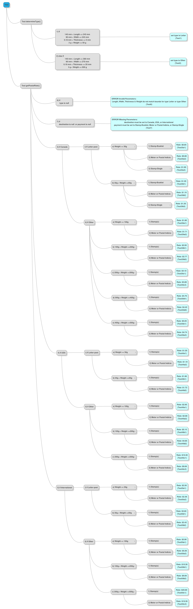

# ECSE428-TDDapp
####Postal rate calculator created using TDD (Test-Driven Development)
####Assignment for Software Engineering Practice (ECSE 428) at McGill

##Running JUnit Tests

 1.	Clone from Github master branch to local repository
 2.	Navigate to the git repository ("ECSE428-TDDapp" directory) from a terminal and run 
 
 ```ant test``` 

 The ant command as specified in build.xml will compile the source code and run all junit tests.

 Note: Must have [Apache Ant](https://ant.apache.org/bindownload.cgi) installed to run ant commands and a java JDK to compile.
 3.	To view an html report of the junit test results, navigate to the junit folder after running step 2 and open `index.html` in a browser window. 


##Running Android App
<br>
<br>
<br>
<br>


##TDD Unit Test Mind Map
<p align="center">
  
</p>
